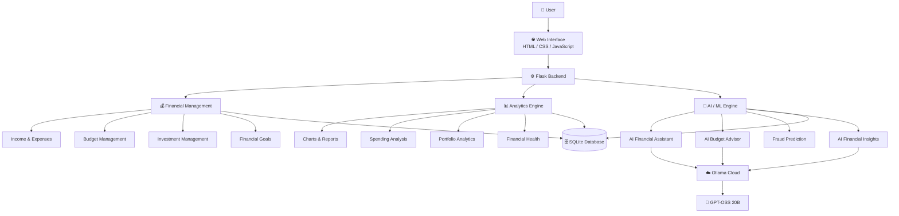
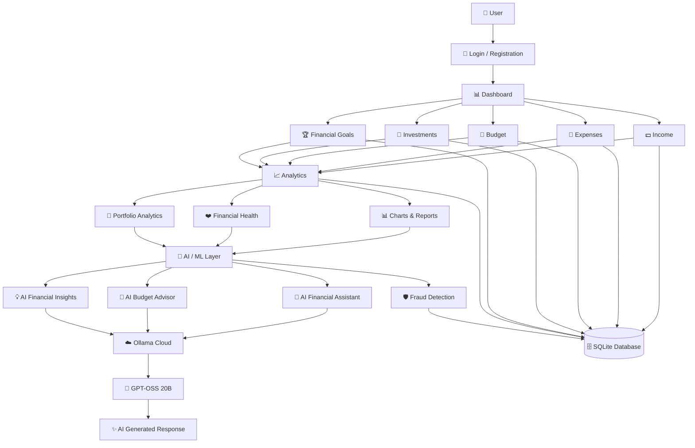
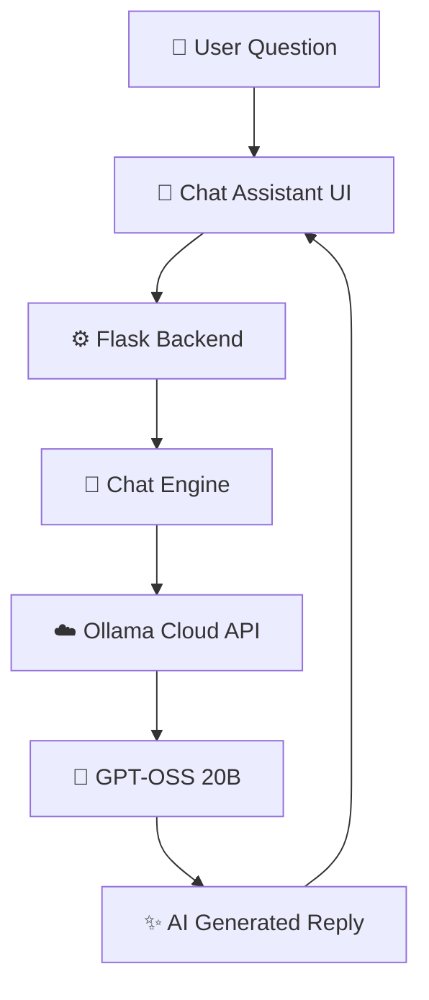

<div align="center">

# 💰 Finance Analytics Platform for Financial Reporting and Budget Tracking

### 📊 AI-Powered Financial Analytics, Reporting & Budget Management Platform

Manage your income, expenses, budgets, investments, financial goals, and AI-driven financial insights through one elegant dashboard.

<br>


<br>

🌐 **Live Demo**

## [🚀 Open Finance Analytics Platform](https://moumitadev.pythonanywhere.com/)

</div>

---

# 📖 Overview

**Finance Analytics Platform for Financial Reporting and Budget Tracking** is a modern **AI-powered financial analytics and reporting platform** developed using Python, Flask, SQLite, HTML, CSS, JavaScript, Machine Learning, and AI technologies.

The platform provides a centralized dashboard where users can manage their personal finances, analyze financial behavior, monitor investments, set financial goals, and receive AI-powered financial assistance.

The system combines:

- 💰 Financial Management
- 📊 Data Analytics
- 🤖 Artificial Intelligence
- 🧠 Machine Learning
- 📈 Data Visualization
- 📄 Financial Reporting
- 🎯 Goal Tracking

into a single web-based platform.

---

# ✨ Key Features

## 💵 Income Management

- Add monthly income
- Update income records
- Delete income records
- View income history
- Monthly income statistics
- Income overview

---

## 💸 Expense Tracking

- Add expenses
- Edit expenses
- Delete expenses
- Category-wise expense tracking
- Monthly expense analysis
- Spending history
- Expense overview

---

## 📊 Interactive Dashboard

- Complete financial summary
- Income vs Expense analysis
- Monthly financial charts
- Savings overview
- Budget status
- Financial Health Score
- Quick financial insights

---

## 🎯 Budget Planning

- Create monthly budgets
- Category-wise budgeting
- Track budget utilization
- Calculate remaining budget
- Budget alerts
- Budget analysis
- AI Budget Advisor

---

## 🤖 AI Financial Assistant

The platform includes an AI-powered conversational financial assistant that allows users to ask natural-language questions related to personal finance.

### AI capabilities include:

- General financial questions
- Saving recommendations
- Spending-related questions
- Budget guidance
- Financial suggestions
- Personalized financial insights
- Natural-language conversations

The deployed application uses **Ollama Cloud with the GPT-OSS 20B model**.

---

## 🧠 AI Financial Insights

The AI module analyzes available financial information and provides useful financial recommendations.

### Includes:

- Spending insights
- Saving recommendations
- Financial health suggestions
- Budget recommendations
- Personalized financial guidance
- Financial behavior analysis

---

## 📈 Financial Analytics

Interactive analytics help users understand their financial behavior.

### Analytics include:

- Income vs Expense
- Expense category analysis
- Budget analysis
- Spending trends
- Investment portfolio analysis
- Portfolio allocation
- Financial health analysis
- Monthly financial statistics

---

## 💼 Investment Portfolio

Users can manage and analyze their investment portfolio.

### Features include:

- Add investments
- Edit investments
- Track invested amount
- Track current value
- Purchase date
- Investment notes
- Portfolio analytics
- Asset allocation
- Investment history

---

## 🎯 Financial Goals

Users can create and monitor financial goals.

### Features include:

- Create financial goals
- Set target amounts
- Track saved amounts
- Track progress
- Calculate completion percentage
- Active / Achieved status
- Goal tracking

---

## 🛡️ Fraud Detection

The platform includes a machine-learning-based fraud prediction module.

### Features include:

- Transaction analysis
- Fraud prediction
- Machine learning model
- Prediction history
- Fraud analysis
- Fraud prediction dashboard

---

## 📄 Financial Reports

Users can generate financial reports based on their financial data.

### Reports include:

- Financial summaries
- PDF reports
- Excel reports
- Income information
- Expense information
- Investment information
- Financial analysis

---

## 📅 Financial Calendar

The financial calendar helps users organize important financial activities and dates.

### Features include:

- Financial event tracking
- Important financial dates
- Calendar-based organization
- Financial planning

---

## 🔔 Notifications

The platform provides notifications and alerts for important financial activities.

Examples include:

- Budget notifications
- Spending notifications
- Savings notifications
- Financial achievement notifications
- Financial status updates

---

## 👤 User Management

The platform includes a complete authentication and profile-management system.

### Includes:

- User registration
- Login
- Logout
- OTP verification
- Forgot password
- Reset password
- Profile management
- User settings

---

## 🌙 Dark Mode

The platform includes a modern dark-mode interface for a comfortable and visually appealing user experience.

---

# 🛠️ Technologies Used

| Category | Technologies |
|---|---|
| **Programming Language** | Python 3.13 |
| **Web Framework** | Flask 3.x |
| **Frontend** | HTML5, CSS3, JavaScript |
| **Database** | SQLite |
| **Data Visualization** | Chart.js |
| **Artificial Intelligence** | Ollama Cloud, GPT-OSS 20B |
| **Machine Learning** | Python ML Models |
| **Document Processing** | PDFPlumber, EasyOCR |
| **Reporting** | PDF, Excel |
| **Package Management** | pip, npm |
| **Version Control** | Git, GitHub |
| **Deployment** | PythonAnywhere |

---

# 🏗️ Project Architecture



The architecture follows a modular approach where the Flask backend connects financial management, analytics, and AI/ML components with the SQLite database.

# 📁 Project Structure

```text
FinanceAnalyticsPlatform/
│
├── ai/
│   ├── finance_ai.py
│   ├── fraud_analysis.py
│   ├── model.py
│   ├── predictor.py
│   └── train_model.py
│
├── database/
│   ├── create_db.py
│   ├── db.py
│   └── schema.sql
│
├── finance_ai/
│   ├── __init__.py
│   ├── chart_engine.py
│   ├── chat_engine.py
│   ├── config.py
│   ├── database_manager.py
│   ├── document_processor.py
│   ├── finance_ai.py
│   ├── memory_manager.py
│   ├── prompt_builder.py
│   ├── report_engine.py
│   ├── tool_router.py
│   └── utils.py
│
├── models/
│   ├── encoders.pkl
│   └── fraud_model.pkl
│
├── static/
│   ├── css/
│   ├── js/
│   ├── images/
│   └── charts/
│
├── templates/
│   ├── ai_dashboard.html
│   ├── ai_insights.html
│   ├── analytics.html
│   ├── asset_allocation.html
│   ├── base.html
│   ├── bills.html
│   ├── budget.html
│   ├── budget_advisor.html
│   ├── chat_assistant.html
│   ├── dashboard.html
│   ├── dataset_management.html
│   ├── edit_bill.html
│   ├── edit_income.html
│   ├── edit_investment.html
│   ├── expense.html
│   ├── expense_list.html
│   ├── feedbacks.html
│   ├── financial_calendar.html
│   ├── financial_goals.html
│   ├── financial_health.html
│   ├── forgot_password.html
│   ├── fraud_predict.html
│   ├── goal_tracker.html
│   ├── income.html
│   ├── income_list.html
│   ├── intelligence_dashboard.html
│   ├── investment.html
│   ├── landing.html
│   ├── login.html
│   ├── login_success.html
│   ├── notification.html
│   ├── portfolio_analytics.html
│   ├── prediction_history.html
│   ├── profile.html
│   ├── register.html
│   ├── reports.html
│   ├── reset_password.html
│   ├── savings_tips.html
│   ├── settings.html
│   └── verify_otp.html
│
├── app.py
├── expenses.csv
├── package.json
├── package-lock.json
├── .gitignore
├── LICENSE
├── README.md
└── TODO.md
```

The project follows a modular structure that separates the Flask application, database layer, AI/ML components, frontend templates, static assets, trained models, and supporting configuration files.

# 🔄 Application Workflow



### Workflow Summary

1. 👤 The user registers or logs into the platform.
2. 📊 The dashboard provides an overview of the user's financial information.
3. 💵 Users can manage income and expenses.
4. 🎯 Users can create and monitor budgets and financial goals.
5. 💼 Users can manage their investment portfolio.
6. 📈 Analytics modules process financial data and generate charts, reports, and financial health information.
7. 🤖 AI/ML modules provide financial assistance, budget recommendations, financial insights, and fraud prediction.
8. ☁️ AI requests are processed through Ollama Cloud using the GPT-OSS 20B model.
9. 🗄️ Financial records and application data are stored in SQLite.


# 🤖 AI Assistant Architecture



The AI Assistant processes user questions through the Flask backend and Chat Engine before sending requests to the Ollama Cloud API. The GPT-OSS 20B model generates the response, which is returned to the user through the Chat Assistant interface.

> 🔐 **Security:** AI API credentials are stored securely using environment variables and are not included in the public repository.

The AI API credentials are stored securely using environment variables and are not included in the public repository.

---

# 🧠 AI & Machine Learning

The project contains multiple AI and machine-learning components.

## 🤖 AI Financial Assistant

Provides conversational answers to financial questions using the Ollama Cloud API and GPT-OSS 20B.

## 💡 AI Financial Insights

Analyzes available financial information and provides recommendations related to spending, savings, and financial health.

## 🎯 AI Budget Advisor

Provides budget-related suggestions based on available financial information.

## 🛡️ Fraud Prediction

Uses trained machine-learning models to analyze transactions and predict potentially fraudulent activity.

## 📊 Financial Analysis

Combines financial records, calculations, analytics, and AI-generated insights to help users understand their financial situation.

---

# 📊 Data Visualization

The application uses interactive charts to present financial information clearly.

### Visualizations include:

- 📊 Income vs Expense charts
- 🥧 Expense category charts
- 📈 Budget analysis charts
- 💼 Portfolio charts
- 📊 Investment allocation
- 📈 Financial trends
- ❤️ Financial health analysis

Charts are generated dynamically based on the user's financial data.

---

# 📄 Document Processing

The platform contains a document-processing module for handling financial documents.

### Supported functionality includes:

- PDF processing
- Financial document extraction
- Document analysis
- Image-based document processing
- Financial information extraction

---

# 🔐 Security & Privacy

The project follows basic security practices to protect sensitive information.

- 🔑 API keys are stored using environment variables.
- 🚫 `.env` files are excluded using `.gitignore`.
- 🗄️ Database files are excluded from GitHub.
- 🐍 Python cache files are excluded.
- 📦 Backup files are excluded.
- 🔐 User authentication is implemented.
- 📱 OTP verification is supported.
- 🔒 Sensitive credentials are not hard-coded in the public repository.

> ⚠️ **Important:** Never add your real API key to GitHub.

---

# 🚀 Deployment

The application has been successfully deployed using **PythonAnywhere**.

### The deployed application includes:

- Flask web application
- SQLite database
- AI Financial Assistant
- Financial Analytics
- Machine Learning modules
- Financial Reporting
- Investment Portfolio Management
- Financial Goals
- Fraud Prediction
- Notifications
- Dark Mode
- User Authentication

### 🌐 Live Application

<div align="center">

## [🚀Open Finance Analytics Platform](https://moumitadev.pythonanywhere.com/)

</div>

---

# 💻 Installation

Follow the steps below to run the project locally.

## 1️⃣ Clone the Repository

```bash
git clone https://github.com/moumitadeb-23/finance-analytics-platform.git
```

---

## 2️⃣ Navigate to the Project

```bash
cd finance-analytics-platform
```

---

## 3️⃣ Create a Virtual Environment

Create an isolated Python environment for the project:

```bash
python -m venv venv
```

### 🪟 Windows

```bash
venv\Scripts\activate
```

### 🍎 macOS / 🐧 Linux

```bash
source venv/bin/activate
```

---

## 4️⃣ Install Dependencies

Install the required Python packages:

```bash
pip install flask
pip install python-dotenv
pip install pandas
pip install numpy
pip install scikit-learn
pip install matplotlib
pip install openpyxl
pip install reportlab
pip install pdfplumber
```

If a `requirements.txt` file is available, you can install all dependencies at once:

```bash
pip install -r requirements.txt
```

---

## 5️⃣ Configure Environment Variables

Create a `.env` file in the project root directory:

```env
OLLAMA_HOST=https://ollama.com
OLLAMA_MODEL=gpt-oss:20b
OLLAMA_API_KEY=your_api_key_here
```

> ⚠️ **Never upload your real API key to GitHub.**

The `.env` file should be excluded through `.gitignore`.

---

## 6️⃣ Run the Application

Start the Flask application:

```bash
python app.py
```

The application can then be accessed through the local Flask server.

---

### 🚀 Quick Installation Summary

```bash
git clone https://github.com/moumitadeb-23/finance-analytics-platform.git
cd finance-analytics-platform
python -m venv venv
```

**Windows:**

```bash
venv\Scripts\activate
```

**macOS / Linux:**

```bash
source venv/bin/activate
```

Then install the dependencies and configure the `.env` file before running:

```bash
python app.py
```

# 🗃️ Database

The application uses **SQLite** as its database.

The database manages information related to:

- 👤 Users
- 💵 Income
- 💸 Expenses
- 🎯 Budgets
- 💼 Investments
- 🏆 Financial Goals
- 🔔 Notifications
- 🤖 Prediction History
- ⚙️ User Settings
- 📊 Financial Records

---

# 🧪 Testing

The application was tested locally before deployment.

Testing included:

- ✅ User registration
- ✅ User login
- ✅ OTP verification
- ✅ Income management
- ✅ Expense management
- ✅ Budget management
- ✅ Investment management
- ✅ Financial goals
- ✅ Analytics
- ✅ Portfolio analytics
- ✅ AI financial assistant
- ✅ AI budget advisor
- ✅ Fraud prediction
- ✅ Financial reports
- ✅ Notifications
- ✅ Dark mode
- ✅ Settings
- ✅ Profile management

The deployed application was also tested on PythonAnywhere.

---

# ⚠️ Limitations

Although the application provides several financial-management and AI features, there are some limitations.

- The platform does not directly connect to bank accounts.
- Financial recommendations should not be considered professional financial advice.
- AI-generated responses may occasionally contain inaccurate information.
- AI functionality depends on availability of the Ollama Cloud service.
- SQLite may not be ideal for very large-scale production systems.
- Fraud detection performance depends on the quality of the training dataset.
- Document OCR functionality may be limited in resource-constrained deployment environments.

---

# 🔮 Future Enhancements

The following features can be added in future versions:

- 📱 Dedicated Android / iOS mobile application
- ☁️ Cloud database integration
- 🏦 Bank API integration
- 💳 Automatic transaction synchronization
- 📧 Email-based financial alerts
- 📲 SMS financial notifications
- 📈 Advanced investment prediction
- 🔮 AI-powered financial forecasting
- 🔐 Two-factor authentication
- 🌍 Multi-currency support
- 💱 Currency conversion
- 📊 Advanced financial dashboards
- 🧠 More personalized AI recommendations
- 📊 Advanced predictive analytics

---

# 📚 Learning Outcomes

This project demonstrates practical knowledge of:

- 🐍 Python programming
- 🌐 Flask web development
- 🎨 Frontend development
- 🗄️ SQLite database management
- 🔌 API integration
- 📊 Data visualization
- 🧠 Machine learning
- 🤖 Artificial intelligence
- 💰 Financial analytics
- 📄 Report generation
- 🔐 Authentication and security
- 🌿 Git and GitHub
- ☁️ Cloud deployment
- ⚙️ Environment variable management
- 🏗️ Software project organization

---

# 👩‍💻 Developer

<div align="center">

## Moumita Deb

🎓 **Student & Developer**

💻 Python • Flask • AI • Machine Learning • Web Development

<br>

🔗 **GitHub**

[github.com/moumitadeb-23](https://github.com/moumitadeb-23)

<br>

🌐 **Live Project**

[Open Finance Analytics Platform](https://moumitadev.pythonanywhere.com/)

</div>

---

# ⭐ Support

If you found this project useful, please consider giving it a **⭐ Star** on GitHub.

Your support motivates further improvements and future releases. 💙

---

# 📜 License

This project is licensed under the **MIT License**.

See the [LICENSE](LICENSE) file for more details.

### MIT License Permissions

- ✅ Commercial use
- ✅ Modification
- ✅ Distribution
- ✅ Private use

### Conditions

- 📜 Preservation of the copyright notice
- 📜 Preservation of the license notice

---

# 💙 Thank You for Visiting

<div align="center">

## 💰  Finance Analytics Platform for Financial Reporting and Budget Tracking

 Finance Analytics Platform for Financial Reporting and Budget Tracking is developed as an AI-powered personal finance management platform to demonstrate modern web development practices, financial analytics, database management, machine learning, and AI-assisted decision making.

<br>

💰 **Manage Your Money**

📊 **Understand Your Finances**

🤖 **Get AI-Powered Insights**

🎯 **Achieve Your Financial Goals**

<br>

⭐ **If you like this project, don't forget to star the repository!**

<br>

### Made with ❤️ by Moumita Deb

</div>


